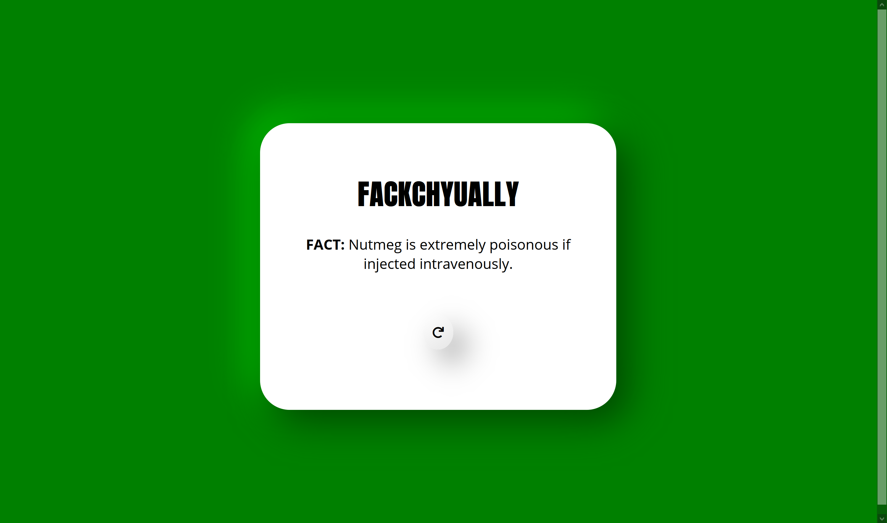

# FACKCHYUALLY | A random FACT Generator.

> A screenshot of the homepage displaying a random fact.

Fackhyually is a random fact generator. I built it using HTML, CSS, and Vanilla JS.

## Acknowledgements

- I used the Useless Facts API https://uselessfacts.jsph.pl/
- W3 Schools for all the CSS help

